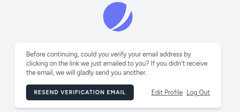
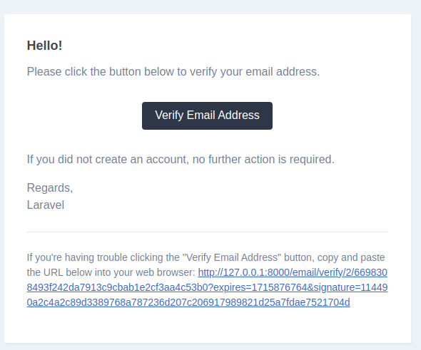

## Registrarse
Queremos confirmar por email .
Actulamente me registro y me redirige directamente a la página Listado.jsx
Quiero que funcione el tema de verificación por email, pero no funciona.

SITUACION:
Si voy a dasboard tras registrarme sí que me indica lo del envío al email y que tengo que verificarlo.

Vamos a modificar esta pantalla (componente)
ACCION:
* Modificar este formato y aplicar traducciones


Veo en MailTrap que el correo se ha enviado.
En MailTrap puedo acceder a ese correo y presionar la verificación

ACCION:
* Modificar este formato y aplicar traducciones
Pero en mi gmail no recibo nada ¿¿¿¿
ACCION:
* Ver cómo puedo hacer para confirmar que recibo el correo.



